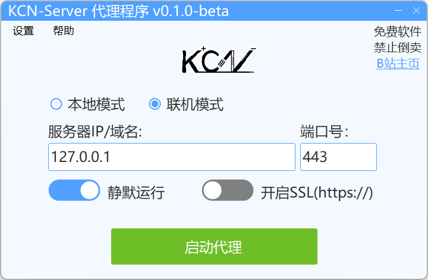

# KCN-Proxy

> 一个代理工具。

---

### 关于软件
- 软件还不完善，就多谢大家debug&提issues了！也欢迎小伙伴提交pr贡献代码~

### 软件下载
- 开箱即用

请到最新 [Releases](https://github.com/JDDKCN/KCN-Proxy/releases/) 处下载。

- 自行编译

请下载 [项目源码](https://codeload.github.com/JDDKCN/KCN-Proxy/zip/refs/heads/main.zip) 自行编译，需要VS环境。

### 软件截图
- v0.1.0-Beta 2023/09/10

### 更新日志

- v0.1.0-Beta 2023/09/10
  1. 发布了程序。

### 使用说明
  1. 如果您的服务端是在本地运行的，请选择单机模式，否则请选择联机模式自定义IP。
  2. 若是单机模式，直接点击启动代理即可，如果是联机模式，请输入服务器IP/域名地址和端口号，再点击连接。若服务器是https连接，请开启使用SSL选项。
  3. 若进入游戏显示连接超时，请点击左上角设置-手动安装CA证书，再次开启代理即可。
  4. 如果您是第一次运行程序，请使用管理员模式启动，否则CA证书无法安装。

### 系统支持
| 系统           | 可用性    | 系统         | 可用性    |
|---------------|----------|--------------|----------|
| Windows 11    | 支持     | Windows XP   | 不支持    |
| Windows 10    | 支持     | Mac OS       | 不支持    |
| Windows 7 - 8 | 支持   | Linux        | 不支持    |

### 免责声明
- 本程序是基于Github项目[mitmproxy](https://github.com/mitmproxy/mitmproxy)制作的代理工具，使用A-GPLv3协议进行开源。项目仅供研究交流用，禁止用于商业及非法用途。使用本软件造成的事故与损失，与作者无关。本程序完全免费，如果您是花钱买的，说明您被骗了。请尽快退款，以减少您的损失。

### 联系方式
- [前往我的B站首页](https://space.bilibili.com/475547854/)
- [前往我的Twitter账号](https://twitter.com/2233KCN)
